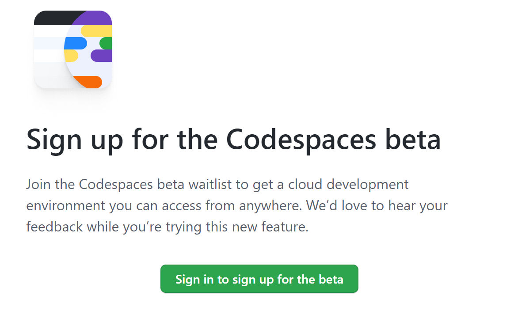
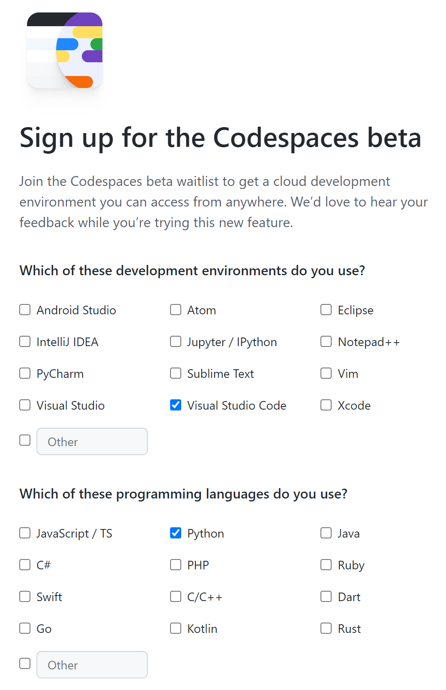
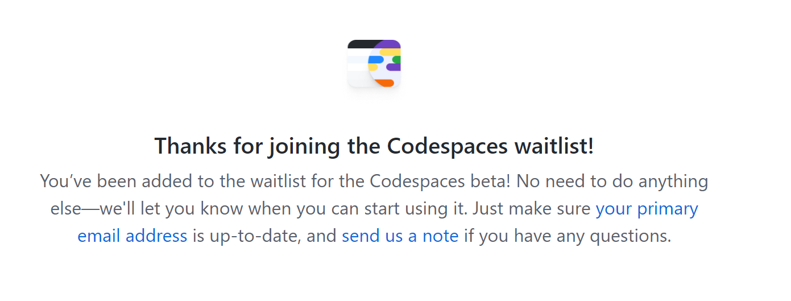

# Codespacesのベータに申し込む

Codespacesを使用するため、申請を行います。2022/7/2現在、ベータ版のためパブリックリポジトリでの個人利用は無料です。

[https://github.co.jp/features/codespaces](https://github.co.jp/features/codespaces)

申し込みページにアクセスし、「ベータ版に申込む」から申し込みができます。

「Sign in to sign up for the beta」を選択

Visual Studio CodeとPythonを選択します。

「Sgin up for the beta」を選択します。

完了画面が表示されます。

githubから、CodeSpaceの案内メールが届いたら登録完了です。１時間ほどで届くようです。

[home](/index.md)    [next](/setup-vscode.md)
