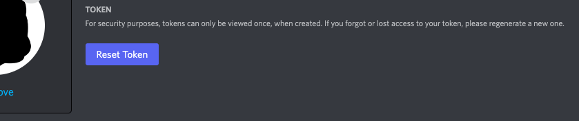
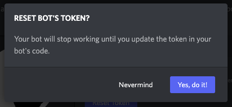
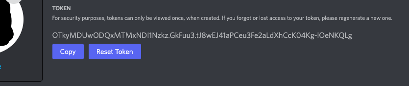
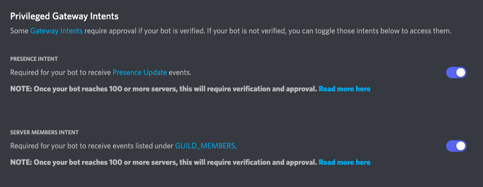
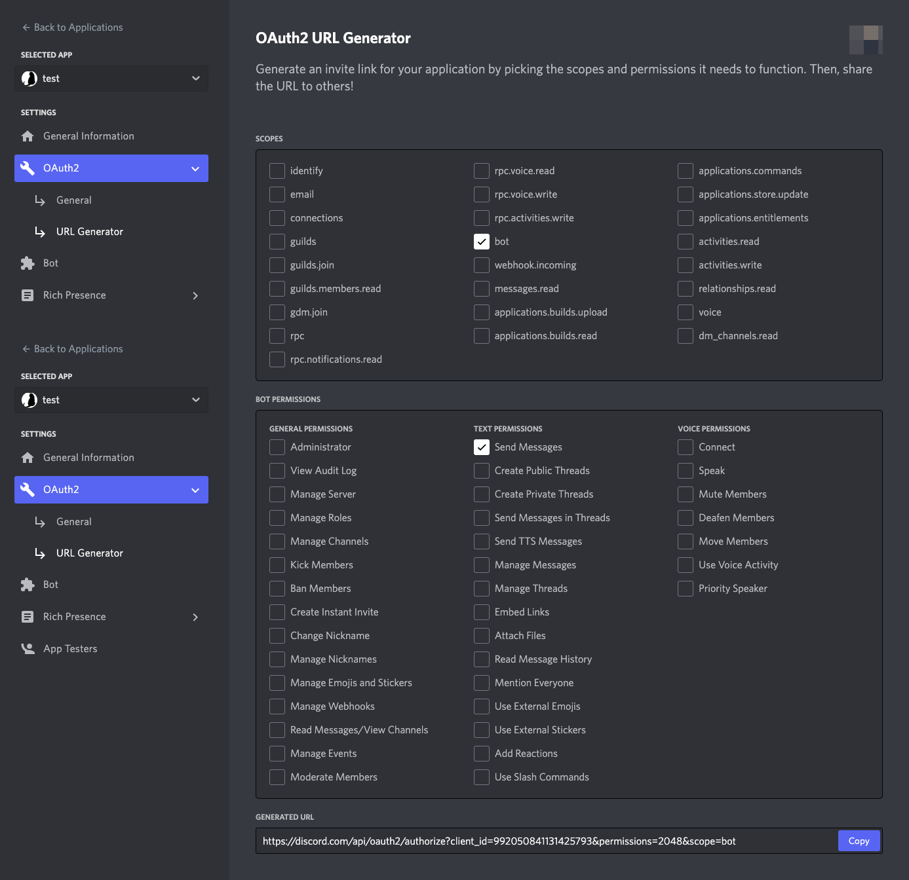
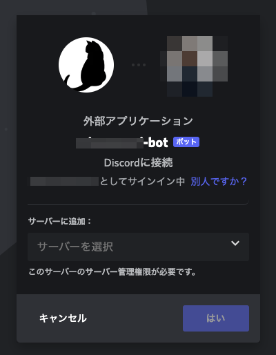
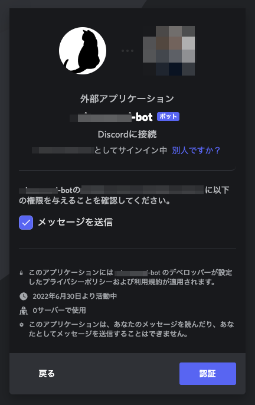

# botの作成

[Discord Developer Portal](https://discord.com/developers/applications)にて、botの登録を行います。

## 必要なもの

- discordアカウント

##　手順

1. [Discord Developer Portal](https://discord.com/developers/applications)にアクセス

右上のNew Applicationを選択します。

2. botの名前を入力します。

3. アイコンを設定します。

素材配布サイトです。必須設定項目ではありませんが、今回は必ず設定してください。

[Google Fonts](https://fonts.google.com/icons)

[Unsplash](https://unsplash.com/)

[ICOOON MONO](https://icooon-mono.com/)

アイコンの設定が終わったら、`Save Changes`を選択してください。

1. Botを追加する

左のメニューからBotを選択。

Add Botを選択

yes, do it!

5. トークンを発行する

Reset Tokenを選択します。２回目以降は、現在のトークンが無効になります。

yes, do it!

トークンをコピーしてメモ帳などに控えます。コピーできるのはここだけなので、かならずコピーしておきましょう。

6. Intentsの設定

Intentsの設定を有効にします。設定を変更したら、`Save Changes`を押します。

7. botの権限設定

`OAuth2` > `URL Generatorから`　`bot`と`Send Messages`にチェックを入れ、生成されたURLにアクセスします。

botをインストールするサーバーの選択画面が表示されます。

権限を確認し、認証します。

サーバーにbotが入ったことを確認してください。

[home](index.md)    [next](/create-repo.md)
