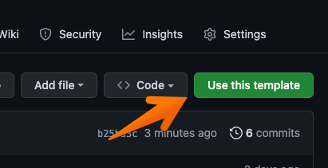
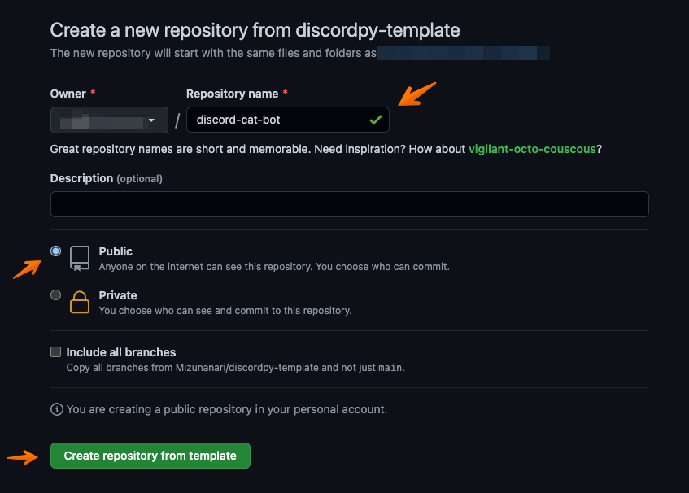
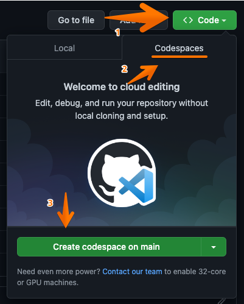
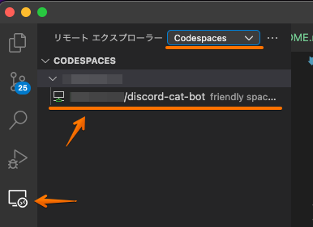

# テンプレートからリポジトリを作成

下記にアクセスします。

[Mizunanari/discordpy-template](https://github.com/Mizunanari/discordpy-template)

リポジトリの名前を入力し、パブリック（公開設定）で作成します。  
リポジトリの名前は、半角英数で決めてください。

しばらくするとリポジトリが作成されます。

## **Docker**を使用する場合

Dockerを使用する場合は、下記の手順です。CodeSpaceを利用する場合は、ページ下部の[Codespacesを利用する場合](#**Codespaces**を利用する場合)をご覧ください。

### プロジェクトのclone

自分のリポジトリからプロジェクトをcloneします。いくつか方法があります。

1. [GitHub Desktop](https://desktop.github.com/)
2. [GitHub CLI](https://cli.github.com/)

__GitHub Desktop__

英語ですが、GUIから操作できるため初心者向けです。

[GitHub Desktopからのリポジトリのクローンとフォーク - GitHub Docs](https://docs.github.com/ja/desktop/contributing-and-collaborating-using-github-desktop/adding-and-cloning-repositories/cloning-and-forking-repositories-from-github-desktop)

__GitHub CLI__

コマンドラインが使えるかた向け。`git`コマンドが使用できる必要があります。
`gh auth login`を使用してブラウザから簡単に認証できます。

### vscordで開発する

クローンしたプロジェクトをvscordでひらきます。

`cmd + shift + P`(mac) または `ctr + shift + P`にてコマンドパレットをひきます。
コマンドから`Remote-Containers: Reopen in Container`を選び実行します。

プロジェクトが仮想環境で開きます。

## **Codespaces**を利用する場合

ブラウザで開発する場合は、作成されるまでしばらく待ちます。

vscodeで開発を行う場合には、Open this codespace in VS Code Desktopを選択します。

vscodeによる開発をお勧めします。vscodeはインストールする必要があります。

### ２回目以降の接続の仕方

下記がインストールされていることを確認します。  
githubへのログインも必要です。

- [GitHub Codespaces - Visual Studio Marketplace](https://marketplace.visualstudio.com/items?itemName=GitHub.codespaces)

vscodeを開き、リモートエクスプローラー > Codespaces > リポジトリの順番に選択し、Codespaesを起動します。

[home](/index.md)   [next](/run-script.md)
