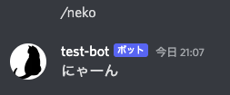

# discordボットを作成しよう！

[discordpy](/about-discordpy.md)を活用してdiscord botを作成します。

まずはテンプレートをコピーしてボットを動かすところまで、解説します。
作成後はソースコードを改変して、オリジナルのボットを作成してみてください。

テンプレートプロジェクトでは、discordのチャンネルにて`/neko`と発言すると`にゃーん`とbotが投稿します。

## 環境のセットアップ

まずは開発環境を整えます。下記の記事を参考に、操作をしてください。

[Visual Studio Code のインストールと設定](/setup-vscode.md)

開発には、DockerとCodespacesのどちらかを使用できます。
2022/08/28現在、Codespacesのベータ申し込み（無料）ができなくなってしまったためDockerを用いて開発を行う必要があります。

* **Docker**を使用する場合

ローカルで開発を行いたい場合は、Dockerを使用することができます。

[Dockerのインストール](install-docker.md)

[Dockerを使用して開発を行う](/use-docker.md)

* **Codespaces**を使用する場合

パソコンの能力が高くない場合はクラウドに開発環境を構築するのがおすすめです。

[Codespacesのベータに申し込む](/codespace-beta.md)

## discord botの作成

まずは、discord botを登録します。

[discord botの作成](/create-discord-bot.md)

## プロジェクトのコピー

テンプレートプロジェクトを自分のリポジトリにコピーします。

[テンプレートからリポジトリを作成](create-repo.md)

## スクリプトの実行

CodeSpacesを使用して、プログラムを実行します。

[スクリプトの実行方法](run-script.md)

## 開発にあたって

テンプレートプロジェクトのソースコードを変更するにあたって、必要になるかもしれない情報です。

[Pythonパッケージの管理](package-management.md)

[Pythonで型を活用する](python-type-hints.md)

[開発に関するTips](/tips.md)

## この記事やサンプルを作るにあたって参考にしたサイト

[Pythonで実用Discord Bot(discordpy解説) - Qiita](https://qiita.com/1ntegrale9/items/9d570ef8175cf178468f)

[Discord Botアカウント初期設定ガイド for Developer - Qiita](https://qiita.com/1ntegrale9/items/cb285053f2fa5d0cccdf)

[Botアカウント作成](https://discordpy.readthedocs.io/ja/latest/discord.html#discord-intro)