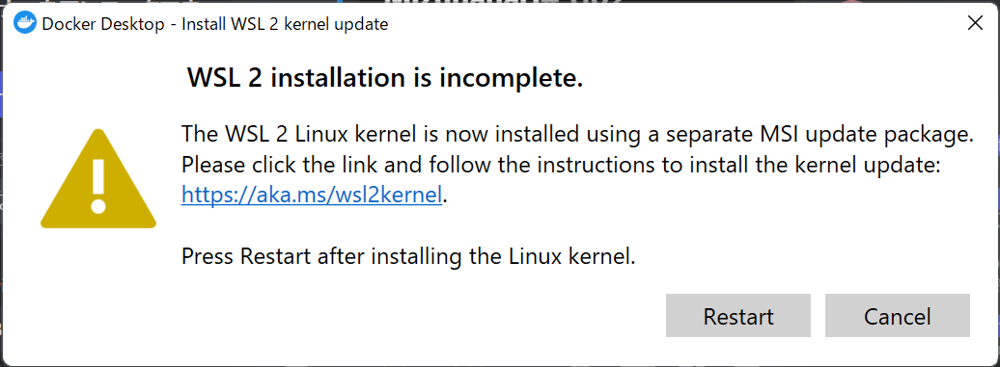
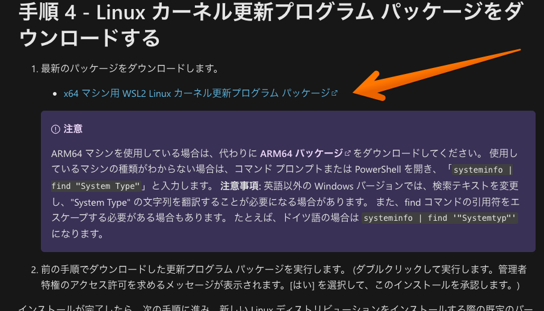
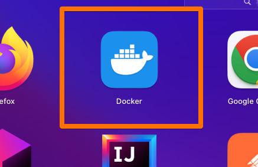

# Dockerのインストール

## windowsの場合

こちらのリンクを参考にしてください。
インストール後にDocker Desktopが動作しない場合は、再起動を行なってください。

[VisualStudioCodeリモート開発を使用したコンテナー内での開発](https://code.visualstudio.com/docs/remote/containers#_installation)

[Install Docker Desktop on Windows](https://docs.docker.com/desktop/install/windows-install/#install-docker-desktop-on-windows)

### エラーが表示される場合

パッケージが最新ではないとエラーが表示されます。



上記エラーが表示される場合は、[こちらのリンクから](https://docs.microsoft.com/ja-jp/windows/wsl/install-manual#step-4---download-the-linux-kernel-update-package)**x64 マシン用 WSL2 Linux カーネル更新プログラム パッケージ**をインストールしてください。



インストールが終わったら設定に入ります。

[next](/use-docker.md)

## macの場合

homebrewをインストールしているのであれば、homeberwでインストールするのが良いです。

## homebrewを使用する場合

homebrewがインストール済みであることが条件です。

```zsh
brew install --cask docker
```

DockerをLaunchpadから起動します。



## 公式Docにしたがう場合

[VisualStudioCodeリモート開発を使用したコンテナー内での開発](https://code.visualstudio.com/docs/remote/containers#_installation)

[home](/index.md)   [next](/use-docker.md)
