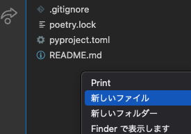
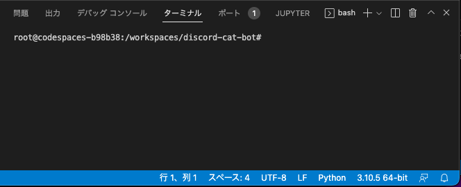
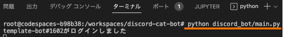

## スクリプトの実行方法

discord.pyのテンプレートを実行する方法です。

1. __`.env`ファイルの作成__

.envファイルをプロジェクトルートに作成します。
エクスプローラーで右クリックから新しいファイルを選択します。



ファイル名は`.env`にします。ファイルの内容は下記の通りです。`アクセストークン`は、discord botのアクセストークンに置き換えます。

```text
BOT_TOKEN=アクセストークン
```

ファイルの編集が終わったら、保存します。
`ctrl + s`(windows)または、`cmd + s`(mac)にて保存できます。

2. __スクリプトの実行__

ターミナルが表示されているかを確認します。



ターミナルが表示されていない場合は、メニューバーから`ターミナル` > `新しいターミナル`を選択します。


ターミナルに下記のコマンドを入力するとbotが実行されます。

```bash
python ./discord_bot/main.py
```

成功するとbotのログインがターミナル上で通知されます。



3. __discordから確認__

botをインストールしたdiscordサーバーにて、`/neko`とコマンドを入力します。


botから返信があれば成功です。

## 備考

README作成時の環境は下記の通りです。

```bash
# python --version
Python 3.10.5

# which python
/usr/local/bin/python
```

[home](/index.md)