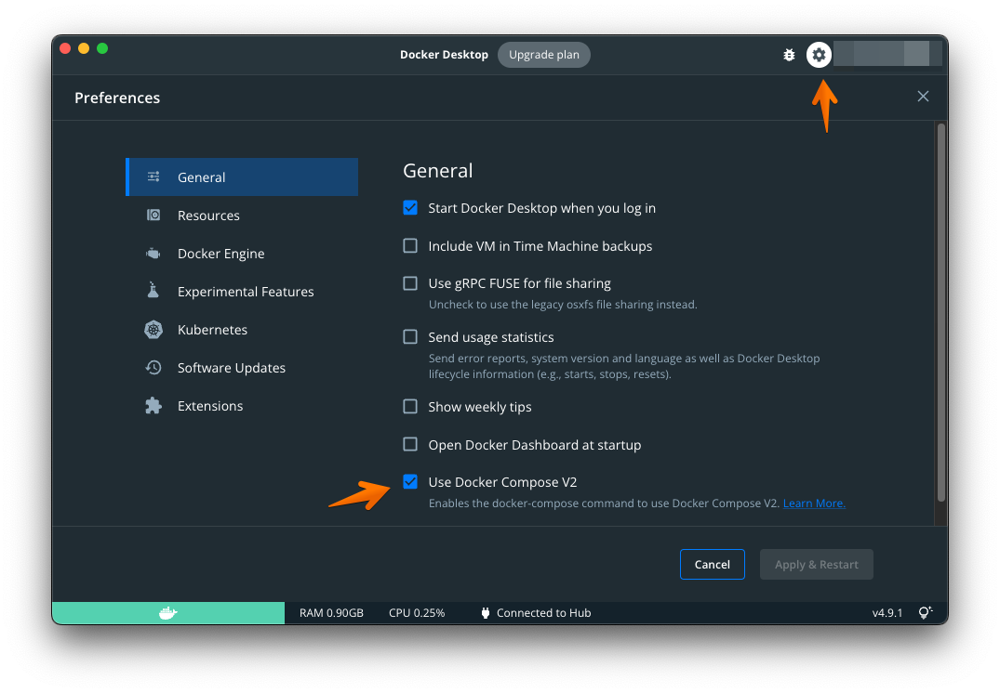
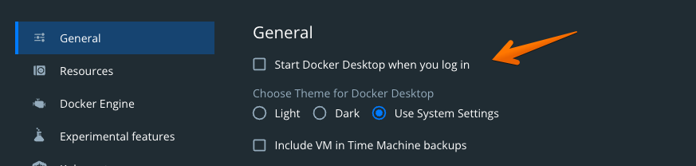

# Dockerを使用して開発を行う

Dockerの設定を行います。

## Dcokerの設定

1. `Use Docker COmpose V2`にチェックマークを入れてください。



2. パソコン起動時に立ち上げない(※任意)



## Visual Studio Codeの設定

下記の拡張機能をvscodeにインストールします。ターミナルからコマンドを打ちこむか、ブラウザかvscodeからインストールしてください。

[Remote - Containers - Visual Studio Marketplace](https://marketplace.visualstudio.com/items?itemName=ms-vscode-remote.remote-containers)

```
code --install-extension ms-vscode-remote.remote-containers
```

参考リンク

[Developing inside a Container using Visual Studio Code Remote Development](https://code.visualstudio.com/docs/remote/containers#_open-a-folder-on-a-remote-ssh-host-in-a-container)

[home](/index.md)